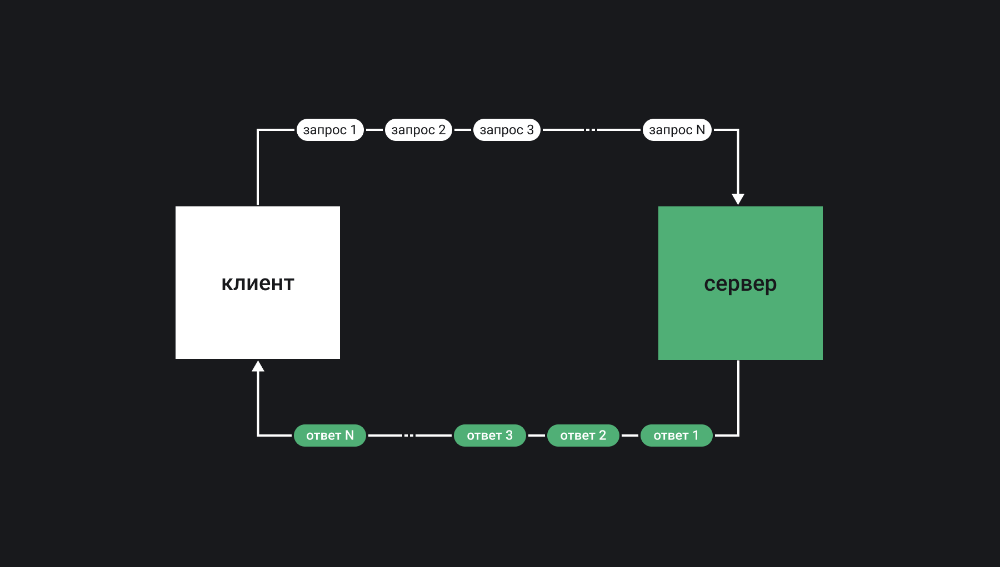

## Кратко

Передача данных в компьютерных сетях возможна благодаря протоколам. Протокол — это набор правил, по которым работают все сетевые устройства. Данные от одного сетевого устройства к другому передаются пакетами, размер и состав которых определяется конкретным протоколом. Сетевыми устройствами могут быть компьютеры, маршрутизаторы, концентраторы, сетевые шлюзы, файрволы, точки доступа и прочие.

У сетевого устройства обязательно есть адрес, это позволяет пакетам попасть куда нужно. Сеть устроена так, что пакеты постоянно пытаются найти сетевое устройство с целевым адресом. На сетевом устройстве можно прописать правила о том, что нужно делать c пакетами, как их обрабатывать или куда отправлять дальше по сети. Эти правила определяются настройками сетевой службы. Сетевая служба — это специальное приложение, иногда включённое в состав операционной системы, которое позволяет пользоваться [сетевыми сервисами](https://ru.wikipedia.org/wiki/Сетевые_сервисы) другим приложениям. Сетевые сервисы — это набор функций устройств, которыми можно воспользоваться через сеть, например, сервис печати или сервис обмена файлов с файловым хранилищем.

Например, нам нужно передать файл по сети. На источнике файл разбивается на пакеты. Пакеты отправляются через сетевое соединение. Каждый пакет ищет целевое сетевое устройство самостоятельно. Когда пакеты попали на него, они собираются в файл.

## Как понять

Чтобы работать с сетью, необходимо представлять себе, как работает сетевой протокол. Например, чтобы отобразить страницу в браузере, нужно задействовать протокол [HTTP](https://developer.mozilla.org/ru/docs/Web/HTTP). Это протокол прикладного уровня (согласно модели [OSI](https://ru.wikipedia.org/wiki/Сетевая_модель_OSI)), который позволяет передавать данные между клиентом и сервером, как показано на рисунке:

Разберём примерный сценарий работы протокола HTTP:

1. Пользователь набирает адрес страницы (имя домена и внутренний путь на сайте) в адресной строке браузера и запускает загрузку страницы.
1. Браузер обращается к сетевой службе на компьютере и формирует сетевой запрос. Запрос состоит из информации о целевой странице в виде текста.
1. Запрос разбивается на пакеты и отправляется путешествовать по сети Интернет. Адресом целевого сетевого устройства будет ближайший DNS-сервер (DNS — Domain Name System). DNS-сервер — это специальный сервер, на котором есть список соответствия сетевого адреса адресу страницы.
1. DNS-сервер меняет адрес целевого сетевого устройства пакетов на адрес сервера, на котором расположен запрашиваемый пользователем сайт, и отправляет пакеты дальше по сети.
1. Запрос в виде пакетов доходит до сетевой службы сервера, собирается из пакетов и обращается к веб-серверу.
1. Веб-сервер по запросу от пользователя формирует ответ — запрашиваемую HTML-страницу.
1. HTML-страница и информация об адресе компьютера пользователя отдаются сетевой службе, которая разбивает всё на пакеты и отправляет в сеть.
1. Сетевая служба пользователя принимает набор пакетов с HTML-страницей, объединяет их в один файл и отдаёт браузеру.
1. Браузер отображает HTML-страницу. Ресурсы этой страницы (шрифты, картинки, видео, стили, JavaScript) догружаются по похожей схеме.

### Работа сетевых устройств

У каждого сетевого устройства есть собственный сетевой адрес. В Интернете это [IP-адрес](https://ru.wikipedia.org/wiki/IP-адрес), от Internet Protocol (межсетевой протокол). Благодаря этому протоколу пакеты, которые отправляются по сети, находят наиболее короткий путь от источника к адресату. 

Кроме IP-адреса используются ещё и [порты](https://ru.wikipedia.org/wiki/Порт_(компьютерные_сети)). Порт — это число, которое обозначает номер соединения. Порт необходим, для того чтобы определить программу или драйвер устройства в сети, который будет обрабатывать пришедший пакет или от которого отослать исходящий. Количество портов ограничено и находится в диапазоне от 1 до 65 535.

Для передачи пакетов от одного сетевого устройства к другому в Интернете используются протоколы транспортного уровня, которые делятся на две группы: с проверкой целостности данных и без неё. 

Для передачи веб-страниц или файлов по сети используются [TCP](https://ru.wikipedia.org/wiki/Transmission_Control_Protocol) (Transmission Control Protocol — протокол управления передачей) или [TLS](https://ru.wikipedia.org/wiki/TLS) (Transport Layer Security — протокол защиты транспортного уровня). Эти протоколы проверяют целостность данных, запрашивают утерянные пакеты или пакеты, в которых была найдена ошибка. 

Для передачи видео или аудио часто применяется [UDP](https://ru.wikipedia.org/wiki/UDP) (User Datagram Protocol — протокол пользовательских датаграмм), который не обращает внимание на утерянные пакеты или пакеты с ошибками. Такой протокол позволяет передавать больше информации, но с потерями.

Пары TCP/IP, TLS/IP или UDP/IP обеспечивают передачу пакетов между сетевыми устройствами и обычно называются стеками протоколов передачи данных. В современных операционных системах служба для работы с пакетами, адресами и портами часто реализуется на уровне ядра. Правила же обработки пакетов можно настраивать.

### Работа с данными на уровне приложений

В адресной строке браузера вы наверняка видели буквы `http` или `https`. Это протоколы прикладного уровня, которые описывают уже не пакеты и адреса сетевых устройств, а правила формирования набора данных для передачи того или иного формата. Часто `http` ассоциируется с небезопасным сайтом, многие браузеры сообщают нам об этом.

Применение `https` внесло ряд новых правил обработки данных, которые отныне не должны были передаваться в открытом виде, а должны были шифроваться. В протоколе HTTP используется TCP  в качестве транспортного протокола, который совсем никак не защищает данные. Если подключиться к одному из сетевых устройств, через которое проходят пакеты, можно прочитать их содержимое. Протокол HTTPS использует другой протокол транспортного уровня — TLS, который подразумевает шифрование пакетов. Данные пользователя передаются в зашифрованном виде.

Браузер является одним из приложений на компьютере. Он использует определенный сетевой порт или несколько портов для отправки данных на сервер и получения данных, используя протоколы HTTP/HTTPS, UDP и другие. Также работает и почтовый клиент, только по другим протоколам — IMAP, POP3, SMTP. Мессенджер тоже использует определённые протоколы для обмена сообщениями, например, ICQ, IRQ, Jabber. Протоколы прикладного уровня лишь определяют формат передаваемых данных.

### Сетевая служба и сетевые сервисы

Сетевая служба — это способ организации передачи данных на уровне операционной системы. Сетевые сервисы — это конкретные приложения / службы / демоны, которые работают в качестве поставщика данных: веб-серверы, серверы для обмена электронной почтой, серверы сообщений для мессенджеров, FTP-серверы, VPN-серверы, серверы для IP-телефонии и прочее. Сетевая служба обеспечивает создание соединения (сокета) для сетевого сервиса и привязку его к определённому порту. После того как такое соединение создано, сетевая служба посылает все пакеты от сервиса или к сервису через указанный порт.

Например, в браузере для передачи веб-страниц через протокол HTTPS по умолчанию используется порт 443, то есть `https://developer.mozilla.org/` и `https://developer.mozilla.org:443` эквивалентны. Поэтому браузер подставляет `:443`, даже не отображая это в интерфейсе. Порт даёт понять сетевой службе на сервере, какой сервис будет использоваться для обработки данных, которые приходят в виде пакетов.

[Существуют стандарты](https://www.iana.org/assignments/service-names-port-numbers/service-names-port-numbers.xhtml) от [IANA](https://ru.wikipedia.org/wiki/IANA) (Internet Assigned Numbers Authority — «Администрация адресного пространства Интернет»), в которых описаны номера портов и соответствующие им сетевые сервисы. В стандартах также описаны диапазоны адресов, которые можно использовать для любых задач. Например, локальные веб-серверы запускают на порте 8080 или 8000.

В большинстве операционных систем в Терминале работает команда [`netstat -an`](https://ru.wikipedia.org/wiki/Netstat), с помощью которой можно узнать информацию о текущем состоянии сетевой службы. В выводе этой команды будет отображена таблица со всеми открытыми на данный момент соединениями с указанием протокола передачи данных, IP-адресов и портов источника и адресата и состояния этого соединения.

Пару IP-адресов источника и адресата с указанием соответствующих сетевому сервису портов называют маршрутом. Статические маршруты обычно прописаны в настройках сетевой службы, а динамические формируются с помощью специальных протоколов маршрутизации. На основе маршрутов, сформированных на сетевых устройствах, пакеты и могут найти адресата, IP-адрес целевого сервера, компьютера пользователя, любого устройства в Интернете.
